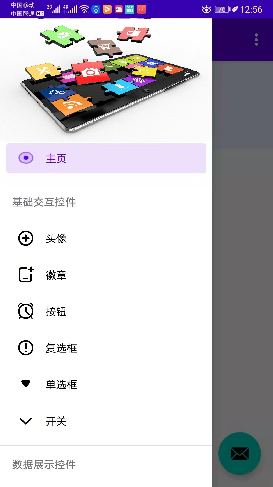
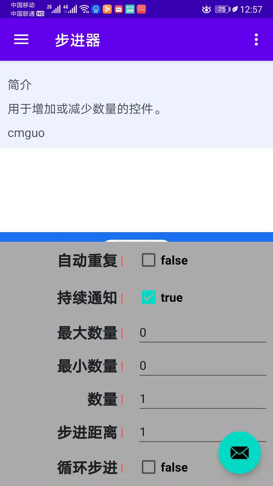

# UI 基础库（Android）

 

## 特性
- 本着简单实用为目标，每个控件都能够满足基本的需求，可进一步定制
- 有统一的设计思路，也不搞另类，与 Android API 高度融合
- 支持 Android Daynight 模式，并简单加强，对业务没有侵入性
- Kotlin 语言实现，支持 MVVM 动态绑定
- 简单灵活的演示框架，交互式演示，动态修改样式，所见即所得

## 使用说明（Document）
- [在线使用说明文档](docs/Library.md)
- 在演示 Demo 中也可以查看文档

## 演示框架
演示框架功能特性
- 抽屉式控件列表，随时选择并切换演示控件
- 上下文属性配置交互，随时随地改变控件的样式
- 夜间模式一键切换
- 可开关的网格背景，视觉设计的最爱
- 随时查看关联的使用说明文档
